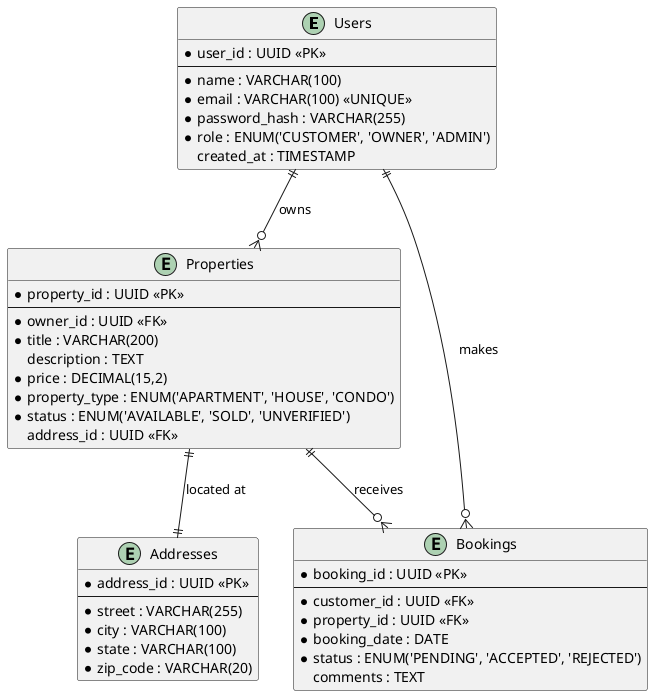
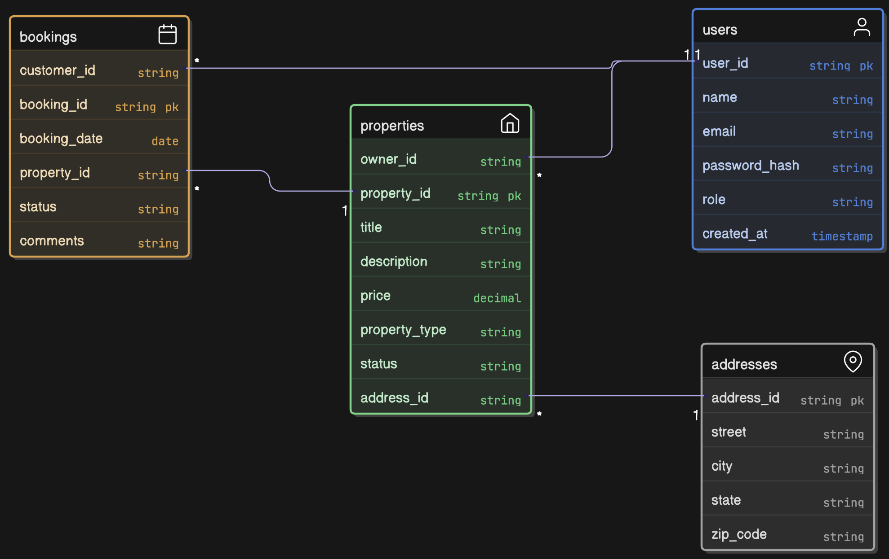

# Entity Relationship (ER) Diagram

## Database Tables and Relations
The relational schema is designed to support high data integrity and efficient querying for property searches and booking management.

### Key Entities:
- **Users:** Stores credentials and profile data for all actors.
- **Properties:** Central table for listing details.
- **Bookings:** Join table representing the interaction between users and properties.
- **Addresses:** Stores geographic information to avoid redundancy.

## PlantUML Source

