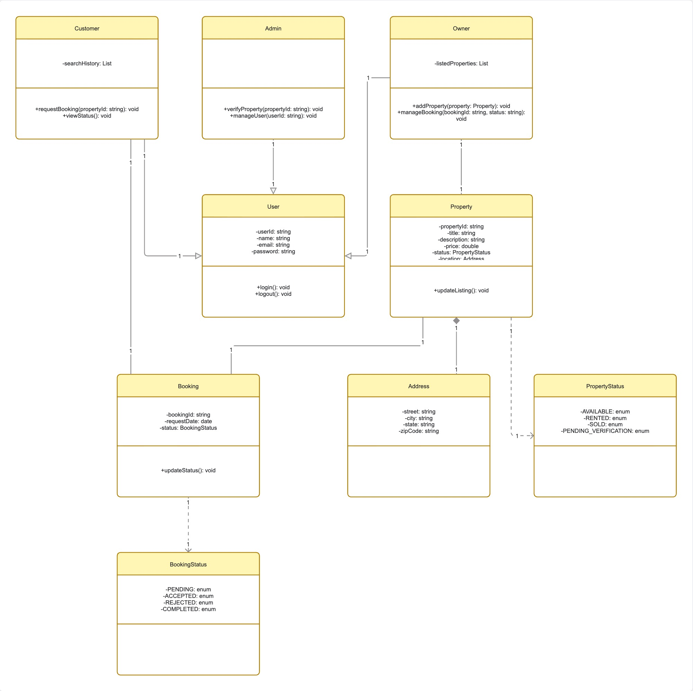
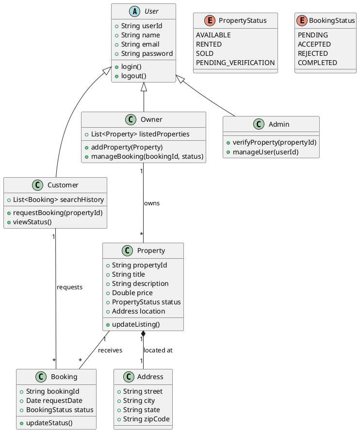

# Class Diagram

## Major OOP Classes
The system follows a modular object-oriented design to ensure scalability and ease of maintenance. The diagram highlights core entities and their relationships.

### Key Classes:
- **User (Base):** Abstract class containing common attributes for all users.
- **Customer, Owner, Admin:** Specific implementations with role-based behaviors.
- **Property:** Represents a real estate asset with attributes like price, location, and status.
- **Booking:** Represents the transactional relationship between a Customer and a Property.
- **Address:** Compositional element for Property and User locations.

## PlantUML Source

