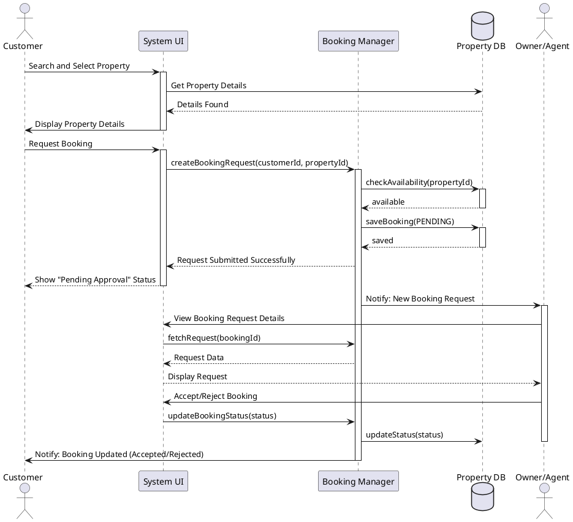

# Sequence Diagram

## Main Flow: Booking Request
This diagram demonstrates the interaction between a Customer, the System, and the Owner during a typical booking request lifecycle.

### Steps:
1. Customer initiates a booking request for a specific property.
2. The System validates availability and persists the request.
3. The Owner is notified of the new request.
4. The Owner reviews the request and performs an action (Accept/Reject).
5. The System updates the status and notifies the Customer of the decision.

## PlantUML Source

