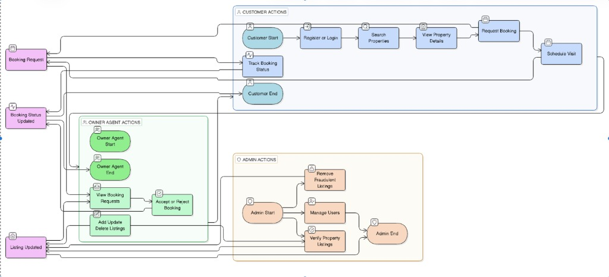
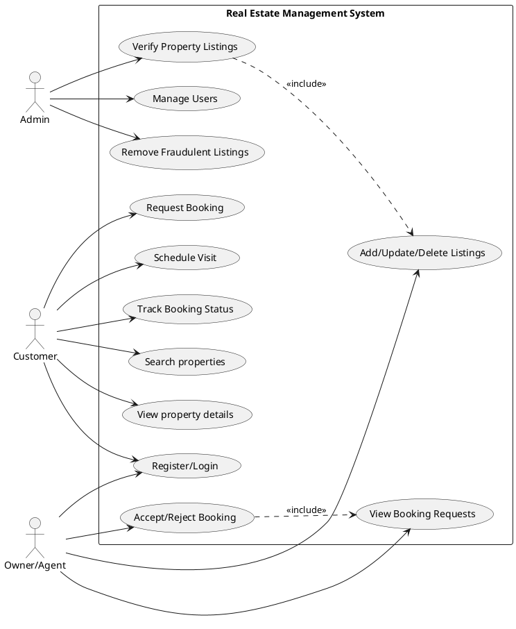

# Use Case Diagram

## Use Case Explanation
The Use Case Diagram illustrates the functional requirements of the system by showing the interactions between different actors and the system's core functionalities.

### Actors
- **Customer:** The primary user seeking to rent or buy properties.
- **Owner/Agent:** The user providing the listings.
- **Admin:** The system orchestrator responsible for verification and moderation.

### Core Functions
- **Listing Management:** Creating and maintaining property data.
- **Search & Discovery:** Finding relevant listings.
- **Booking Workflow:** Process from request to acceptance/rejection.
- **Moderation:** Ensuring platform safety.

## PlantUML Source

